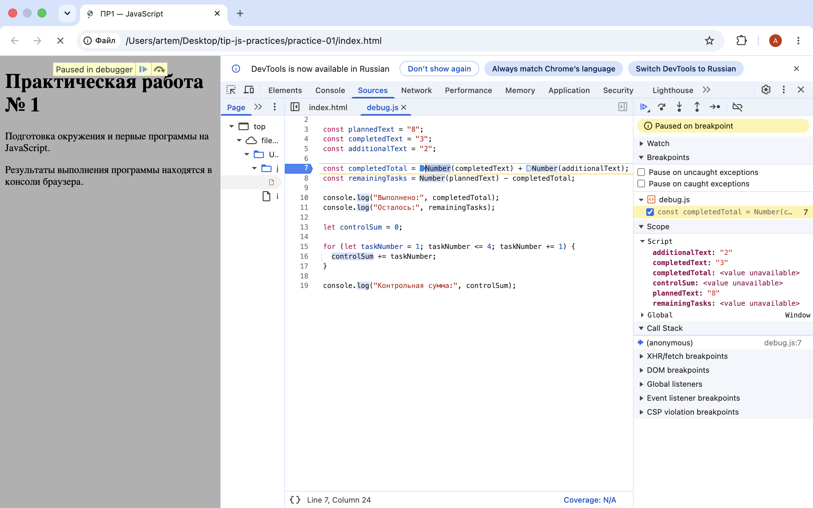

# Практическая работа № 1

Подготовка окружения и первые программы на JavaScript.

## Автор

- Имя: Попков Артём Викторович
- Группа: ЭФБО-05-25
- Вариант: 7 (totalTasks = 10, completedTasks = 7, dailyLimit = 3)

## Окружение

- ОС: macOS
- Node.js: v24.11.1
- npm: 11.6.2
- Git: 2.50.1
- Браузер: Safari

## Запуск

Из корня репозитория:

    node practice-01/js/hello.js
    node practice-01/js/types.js
    node practice-01/js/progress.js
    node practice-01/js/plan.js
    node practice-01/js/debug.js

В браузере: открыть `practice-01/index.html`, заменить путь в `<script>` на нужный файл, перезагрузить страницу, посмотреть Console.

## Задание 1. Две среды выполнения

Файл `hello.js` запущен двумя способами:

- Через Node.js в терминале.
- Через браузер Safari (открыт `index.html`, вывод в Console).

Различие в последней строке: `typeof document` даёт `"undefined"` в Node.js и `"object"` в браузере. Это связано с тем, что объект `document` предоставляется браузером как часть DOM, а в Node.js DOM отсутствует.

## Задание 2. Типы и преобразования

| № | Выражение | Ожидание | Результат | Тип | Объяснение |
|---|---|---|---|---|---|
| 1 | `"8" + 2` | `"82"` | `"82"` | string | `+` со строкой выполняет конкатенацию |
| 2 | `"8" - 2` | 6 | 6 | number | `-` всегда приводит к числу |
| 3 | `Number("8") + 2` | 10 | 10 | number | явное преобразование в число |
| 4 | `"12" > "3"` | false | false | boolean | строки сравниваются посимвольно |
| 5 | `12 === "12"` | false | false | boolean | строгое равенство без приведения типов |
| 6 | `Number("")` | 0 | 0 | number | пустая строка даёт 0 |
| 7 | `Number("text")` | NaN | NaN | number | нечисловая строка даёт NaN |
| 8 | `Boolean("false")` | true | true | boolean | непустая строка всегда true |
| 9 | `typeof null` | `"object"` | `"object"` | string | историческая особенность JS |
| 10 | `typeof NaN` | `"number"` | `"number"` | string | NaN относится к типу number |

## Задание 3. Сводка выполнения задач

Вариант: `totalTasks = 10`, `completedTasks = 7`.

Вывод:

    Всего задач: 10
    Выполнено: 7
    Осталось: 3
    Прогресс: 70.0%
    Статус: В работе

### Таблица проверок

| Проверка | Входные данные | Ожидаемый результат | Фактический результат | Итог |
|---|---|---|---|---|
| Обычный случай | 10 / 7 | 3 / 70.0% / В работе | 3 / 70.0% / В работе | Пройдено |
| Нет задач | 0 / 0 | «Задач пока нет» | «Задач пока нет» | Пройдено |
| Ничего не сделано | 5 / 0 | 5 / 0.0% / Не начато | 5 / 0.0% / Не начато | Пройдено |
| Всё сделано | 5 / 5 | 0 / 100.0% / Завершено | 0 / 100.0% / Завершено | Пройдено |
| Выполнено больше | 5 / 6 | Ошибка | Ошибка | Пройдено |
| Отрицательное | -1 / 0 | Ошибка | Ошибка | Пройдено |
| Дробное | 5 / 2.5 | Ошибка | Ошибка | Пройдено |
| Строка вместо числа | "5" / 2 | Ошибка | Ошибка | Пройдено |
| Превышение границы | 1001 / 0 | Ошибка | Ошибка | Пройдено |
| NaN | NaN / 0 | Ошибка | Ошибка | Пройдено |

## Задание 4. План выполнения задач

Вариант: `totalTasks = 10`, `completedTasks = 7`, `dailyLimit = 3`.

Вывод:

    Осталось задач: 3
    День 1: выполнено 3, осталось 0
    Потребуется дней: 1

### Таблица проверок

| Проверка | Входные данные | Ожидаемый результат | Фактический результат | Итог |
|---|---|---|---|---|
| Вариант 7 | 10 / 7 / 3 | 1 день | 1 день | Пройдено |
| Общий пример | 12 / 5 / 3 | 3 дня | 3 дня | Пройдено |
| Ровно на день | 10 / 4 / 3 | 2 дня | 2 дня | Пройдено |
| Норма больше остатка | 5 / 3 / 10 | 1 день | 1 день | Пройдено |
| Всё выполнено | 5 / 5 / 2 | 0 дней | 0 дней | Пройдено |
| Нет задач | 0 / 0 / 2 | 0 дней | 0 дней | Пройдено |
| Нулевая норма | 5 / 2 / 0 | Ошибка | Ошибка | Пройдено |
| Дробная норма | 5 / 2 / 1.5 | Ошибка | Ошибка | Пройдено |
| Некорректный ввод | 5 / 6 / 2 | Ошибка | Ошибка | Пройдено |
| Строка как норма | 5 / 2 / "2" | Ошибка | Ошибка | Пройдено |
| Превышение нормы | 5 / 2 / 1001 | Ошибка | Ошибка | Пройдено |

## Задание 5. Отладка

Исходный код содержал две ошибки:

1. `completedText + additionalText` давало `"32"` вместо `5` — строки складывались как текст.
2. Граница цикла `taskNumber < 4` не включала задачу номер 4, сумма получалась `6` вместо `10`.

| Ошибка | Что наблюдалось | Причина | Исправление | Результат |
|---|---|---|---|---|
| Обработка количества | Выполнено: 32, Осталось: -24 | конкатенация строк | `Number(...)` для обоих слагаемых | Выполнено: 5, Осталось: 3 |
| Граница цикла | Контрольная сумма: 6 | условие `<` вместо `<=` | `taskNumber <= 4` | Контрольная сумма: 10 |

## Вывод

Освоены базовые операции JavaScript в двух средах выполнения, различие между строкой и числом, явное приведение типов, условные конструкции и циклы. Наиболее показательной оказалась ошибка с конкатенацией строк: без явного `Number()` оператор `+` даёт текст, а не сумму.